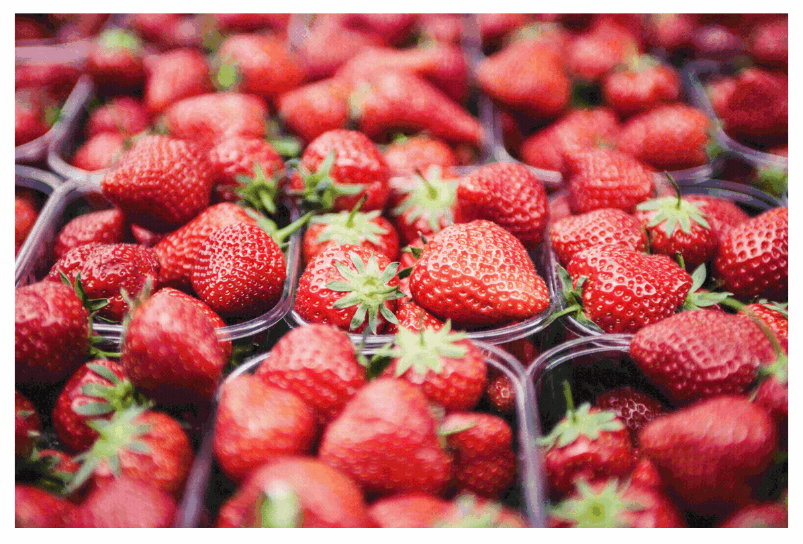

# react-magnifier

**React image zoom component**

- Simple and customizable
- Supports touch screens
- Allows different files for large image and magnifying glass (e.g. thumbnail and high-resolution image)

→ **[Demo](https://react-magnifier.samuelmeuli.com)**

<p align="center">
  
</p>

## Usage

Install the package using NPM:

```
npm install react-magnifier
```

Add the component to your React application:

```jsx
import Magnifier from "react-magnifier";
import yourImage from "./path/to/image";

export default function ExampleComponent() {
  return <Magnifier src={yourImage} width={500} />;
}
```

## Configuration

| Prop             | Type          | Default    | Description                                                                                                                                                      |
| ---------------- | ------------- | ---------- | ---------------------------------------------------------------------------------------------------------------------------------------------------------------- |
| `src` (required) | String        | –          | URL/path of the large image                                                                                                                                      |
| `height`         | Number/String | `'auto'`   | Image height (absolute or relative values possible)                                                                                                              |
| `width`          | Number/String | `'100%'`   | Image width (absolute or relative values possible)                                                                                                               |
| `className`      | String        | `''`       | Class which will be applied to the image wrapper                                                                                                                 |
| `zoomImgSrc`     | String        | –          | URL/path of the image inside the magnifying glass (if not specified, the large image will be used)                                                               |
| `zoomFactor`     | Number        | `1.5`      | Factor by which the zoom image will be scaled (based on the size of the large image)                                                                             |
| `mgWidth`        | Number        | `150`      | Width of the magnifying glass in px                                                                                                                              |
| `mgHeight`       | Number        | `150`      | Height of the magnifying glass in px                                                                                                                             |
| `mgBorderWidth`  | Number        | `2`        | Border width of the magnifying glass in px                                                                                                                       |
| `mgShape`        | String        | `'circle'` | Shape of the magnifying glass (possible values: `'circle'`, `'square'`)                                                                                          |
| `mgShowOverflow` | Boolean       | `true`     | Set this to `false` to cut off the magnifying glass at the image borders. When disabling `mgShowOverflow`, it's recommended that you also set all offsets to `0` |
| `mgMouseOffsetX` | Number        | `0`        | Horizontal offset of the magnifying glass in px when hovering with a mouse                                                                                       |
| `mgMouseOffsetY` | Number        | `0`        | Vertical offset of the magnifying glass in px when hovering with a mouse                                                                                         |
| `mgTouchOffsetX` | Number        | `-50`      | Horizontal offset of the magnifying glass in px when dragging on a touch screen                                                                                  |
| `mgTouchOffsetY` | Number        | `-50`      | Vertical offset of the magnifying glass in px when dragging on a touch screen                                                                                    |

Any other props will be passed down to the `` element. This way, you can e.g. add an `alt` attribute to the image.

## Custom styling

```css
.magnifier {
  /* Styles for <div> around image and magnifying glass */
}

.magnifier-image {
  /* Styles for large image */
}

.magnifying-glass {
  /* Styles for magnifying glass */
}
```

## Development

Requirements: Node.js, Yarn

1. Clone this repository: `git clone [repo-url]`
2. Install all dependencies: `yarn install`
3. Run `yarn start` to generate the library bundle using [Rollup](https://github.com/rollup/rollup) and see the component in action using [Storybook](https://github.com/storybooks/storybook)

Suggestions and contributions are always welcome! Please first discuss changes via issue before submitting a pull request.
